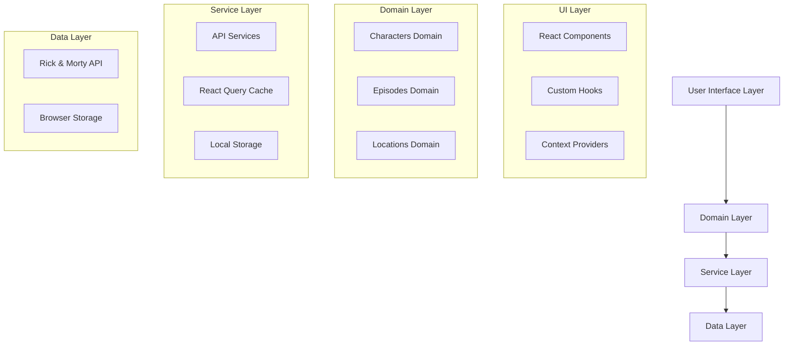
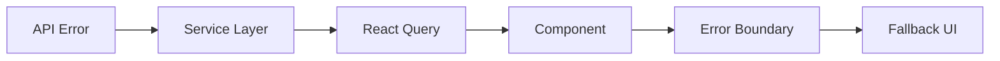

# Architecture Documentation

## Overview

The Rick and Morty Explorer follows a **Domain-Driven Design (DDD)** approach with modern React patterns to create a scalable, maintainable, and performant application.

## 🏛️ High-Level Architecture



## 📁 Folder Structure

### Domain-Driven Organization

```
src/
├── domains/                    # Business domains
│   ├── characters/            # Character domain
│   │   ├── components/        # Character-specific components
│   │   │   ├── CharacterCard.tsx
│   │   │   ├── CharacterList.tsx
│   │   │   └── CharacterDetail.tsx
│   │   ├── hooks/            # Character-related hooks
│   │   │   └── useCharacters.ts
│   │   ├── services/         # Character API services
│   │   │   └── character.service.ts
│   │   └── types/            # Character-specific types
│   ├── episodes/             # Episode domain
│   │   ├── components/
│   │   ├── hooks/
│   │   └── services/
│   └── locations/            # Location domain (future)
├── shared/                   # Shared utilities and components
│   ├── components/          # Reusable UI components
│   │   ├── ErrorBoundary.tsx
│   │   ├── LoadingSpinner.tsx
│   │   ├── Skeleton.tsx
│   │   └── Modal.tsx
│   ├── hooks/              # Shared hooks
│   │   ├── useLocalStorage.ts
│   │   ├── useDebounce.ts
│   │   └── useOptimisticUpdate.ts
│   ├── services/           # Core services
│   │   └── api.service.ts
│   ├── types/              # TypeScript definitions
│   │   ├── api.types.ts
│   │   └── ui.types.ts
│   ├── utils/              # Utility functions
│   │   ├── format.utils.ts
│   │   └── storage.utils.ts
│   └── providers/          # Context providers
│       ├── QueryProvider.tsx
│       └── ThemeProvider.tsx
└── components/             # Legacy components (being migrated)
```

## 🔄 Data Flow

### 1. Component → Hook → Service → API

```typescript
// Component requests data
const { data, isLoading } = useCharacters({ name: "Rick" });

// Hook manages React Query
export function useCharacters(filters: SearchFilters) {
  return useQuery({
    queryKey: characterKeys.list(filters),
    queryFn: () => characterService.getCharacters(filters),
  });
}

// Service handles API calls
export class CharacterService {
  async getCharacters(filters: SearchFilters) {
    return apiService.get<ApiResponse<Character>>("/character", filters);
  }
}

// API service manages HTTP requests
export class ApiService {
  async get<T>(endpoint: string, params?: any): Promise<T> {
    const response = await this.client.get(endpoint, { params });
    return response.data;
  }
}
```

### 2. Error Handling Flow



## 🎯 Design Patterns

### 1. Service Layer Pattern

**Purpose**: Encapsulate business logic and API interactions

```typescript
export class CharacterService {
  private readonly endpoint = "/character";

  async getCharacters(
    filters: SearchFilters = {}
  ): Promise<ApiResponse<Character>> {
    const params = new URLSearchParams();

    if (filters.name) params.append("name", filters.name);
    if (filters.status) params.append("status", filters.status);

    return apiService.get<ApiResponse<Character>>(
      `${this.endpoint}?${params.toString()}`
    );
  }
}
```

### 2. Custom Hook Pattern

**Purpose**: Encapsulate stateful logic and side effects

```typescript
export function useCharacters(filters: SearchFilters = {}) {
  return useQuery({
    queryKey: characterKeys.list(filters),
    queryFn: () => characterService.getCharacters(filters),
    staleTime: 5 * 60 * 1000, // 5 minutes
    gcTime: 10 * 60 * 1000, // 10 minutes
  });
}
```

### 3. Provider Pattern

**Purpose**: Share state and functionality across components

```typescript
export const QueryProvider: React.FC<QueryProviderProps> = ({ children }) => {
  return (
    <QueryClientProvider client={queryClient}>
      {children}
      {process.env.NODE_ENV === "development" && (
        <ReactQueryDevtools initialIsOpen={false} />
      )}
    </QueryClientProvider>
  );
};
```

### 4. Error Boundary Pattern

**Purpose**: Graceful error handling and recovery

```typescript
export const ErrorBoundary: React.FC<ErrorBoundaryProps> = ({
  children,
  fallback,
  onError,
}) => {
  return (
    <ReactErrorBoundary
      FallbackComponent={fallback || ErrorFallback}
      onError={onError}
      onReset={() => window.location.reload()}>
      {children}
    </ReactErrorBoundary>
  );
};
```

## 🔧 State Management Strategy

### 1. Server State (React Query)

- API data caching
- Background updates
- Optimistic updates
- Error handling

### 2. Client State (React Hooks)

- UI state (modals, forms)
- Local preferences
- Component state

### 3. Persistent State (Local Storage)

- User preferences
- Favorites
- Theme selection

## 🚀 Performance Optimizations

### 1. Code Splitting

```typescript
// Lazy loading components
const CharacterDetail = React.lazy(() => import("./CharacterDetail"));

// Route-based splitting
const CharactersPage = React.lazy(() => import("../pages/CharactersPage"));
```

### 2. Memoization

```typescript
// Component memoization
export const CharacterCard = React.memo<CharacterCardProps>(({ character }) => {
  // Component implementation
});

// Hook memoization
const memoizedCharacters = useMemo(() => {
  return characters.filter((char) => char.status === "Alive");
}, [characters]);
```

### 3. Query Optimization

```typescript
// Prefetching
const prefetchCharacter = (id: number) => {
  queryClient.prefetchQuery({
    queryKey: characterKeys.detail(id),
    queryFn: () => characterService.getCharacter(id),
  });
};

// Infinite queries for pagination
export function useInfiniteCharacters() {
  return useInfiniteQuery({
    queryKey: ["characters", "infinite"],
    queryFn: ({ pageParam = 1 }) =>
      characterService.getCharacters({ page: pageParam }),
    getNextPageParam: (lastPage) =>
      lastPage.info.next ? lastPage.info.pages + 1 : undefined,
  });
}
```

## 🧪 Testing Architecture

### 1. Unit Testing Strategy

```typescript
// Component testing
describe("CharacterCard", () => {
  it("should display character information", () => {
    render(<CharacterCard character={mockCharacter} />);
    expect(screen.getByText(mockCharacter.name)).toBeInTheDocument();
  });
});

// Hook testing
describe("useCharacters", () => {
  it("should fetch characters", async () => {
    const { result } = renderHook(() => useCharacters());
    await waitFor(() => expect(result.current.isSuccess).toBe(true));
  });
});
```

### 2. E2E Testing Strategy

```typescript
// User journey testing
test("should search and view character details", async ({ page }) => {
  await page.goto("/");
  await page.fill('[data-testid="search-input"]', "Rick");
  await page.click('[data-testid="character-card"]:first-child');
  await expect(page.locator('[data-testid="character-detail"]')).toBeVisible();
});
```

## 🔐 Security Considerations

### 1. Input Validation

- Sanitize search inputs
- Validate API responses
- Type checking with TypeScript

### 2. Error Handling

- Never expose sensitive information in errors
- Graceful degradation
- Fallback UI for failed requests

### 3. Content Security Policy

```html
<meta
  http-equiv="Content-Security-Policy"
  content="default-src 'self'; 
               img-src 'self' https://rickandmortyapi.com; 
               api-src 'self' https://rickandmortyapi.com;" />
```

## 📈 Scalability Considerations

### 1. Horizontal Scaling

- Stateless components
- API-driven architecture
- CDN for static assets

### 2. Vertical Scaling

- Code splitting
- Lazy loading
- Efficient bundling

### 3. Future Extensibility

- Domain-driven structure allows easy addition of new features
- Service layer abstraction enables API changes
- Component composition supports UI variations

## 🔄 Migration Strategy

### From Legacy to New Architecture

1. **Phase 1**: Create new domain structure alongside existing code
2. **Phase 2**: Migrate components one by one
3. **Phase 3**: Update routing and state management
4. **Phase 4**: Remove legacy code
5. **Phase 5**: Optimize and refactor

### Breaking Changes

- Component API changes
- Hook signature updates
- Service method modifications

## 📚 Additional Resources

- [React Query Documentation](https://tanstack.com/query/latest)
- [Domain-Driven Design](https://martinfowler.com/bliki/DomainDrivenDesign.html)
- [React Architecture Patterns](https://reactpatterns.com/)
- [TypeScript Best Practices](https://typescript-eslint.io/rules/)
